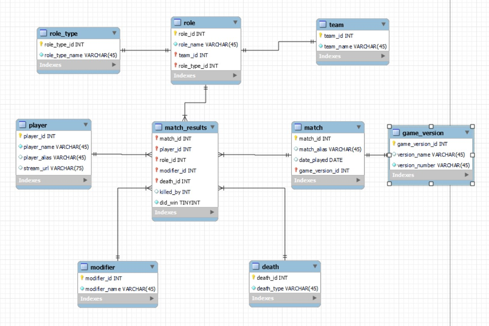

# Overview

A repository that contains a program to connect to a cloud database and perform CRUD operations. The cloud database is an Amazon Web Services (AWS) Relational Database Service (RDS) instance. The program is written in Python and uses the PyMySQL library to connect to the database. The program has a small menu and several options to perform common CRUD operations on the database. While this program could be adjusted to work with almost any relational database stored in a similar fashion, this specific program was designed for the Among_Us_Stats database. This database stores the data and results of individual matches of Among Us played by a group of streams.

To use the program, the user simply needs to run the client.py Python file. With proper credentials stored in an rds_config.py file, the program will connect to the database. A message saying that the connection either succeeded or failed will appear. From there, if the connection was successful, the user will be presented with a menu of options. The user can then select an option and perform the corresponding CRUD operation. Queries are limited to the tables and views that are deemed most useful for the program. Other functions are limited, as well, to keep the program simple for the user. For full functionality and control over the database, other programs such as MySQL Workbench can be used.

This software was designed to make it easier for users to interact with the database. The program is meant to be simple and easy to use. The program is also meant to be a demonstration of how to connect to a Python application to a cloud database and perform CRUD operations. The program is not meant to be a full-featured database management system. For that, other programs such as MySQL Workbench should be used. This program is especially useful for inputting new data regarding the Among Us games.

<!-- TODO
        Provide a link to the YouTube demonstration.
            4-5 minute demo of the software running.
            A walkthrough of the code.
            A view of the cloud database. -->

[Software Demo Video](http://youtube.link.goes.here)

# Cloud Database

The specific cloud database being used by this program is an Amazon Web Services (AWS) Relational Database Service (RDS) instance. There are nine tables and two views currently in use in this database.
The tables are as follows:

- player
- game_version
- match
- role_type
- team
- role
- modifier
- death
- match_results

The views are as follows:

- match_summary
- role_summary

Below is a screenshot of the diagram of the database. The diagram was created using MySQL Workbench. The diagram shows the relationships between the tables and views in the database. The diagram also shows the data types of the attributes in each table and view. The diagram can be found in the repository as a .jpg file.

# Development Environment

The program was written in Python 3.11.0. The program uses the PyMySQL library to connect to the database. The program was written in Visual Studio Code. The program was tested on a Windows 11 machine. The database is hosted on an Amazon Web Services (AWS) Relational Database Service (RDS) instance. The database was created using MySQL Workbench. The database is currently hosted on a db.t4g.micro instance. The database is currently running MySQL 8.0.28.

**Languages:** Python 3.11.0, SQL
**Tools:** Visual Studio Code, MySQL Workbench
**Libraries:** PyMySQL
**Operating System:** Windows 11
**Cloud Database:** Amazon Web Services (AWS) Relational Database Service (RDS) instance

# Useful Websites

- [AWS Lambda Tutorial](https://docs.aws.amazon.com/lambda/latest/dg/services-rds-tutorial.html)
- [AWS Lambda and API Gateway Tutorial](https://docs.aws.amazon.com/lambda/latest/dg/services-apigateway-tutorial.html#services-apigateway-tutorial-resource)
- [AWS Python Lambda Functions Tutorial](https://docs.aws.amazon.com/lambda/latest/dg/python-package.html)
- [PyMySQL Documentation](https://pymysql.readthedocs.io/en/latest/index.html)
- [MySQL Tutorial](https://www.mysqltutorial.org/mysql-basics/)
- [W3 Schools SQL Tutorial](https://www.w3schools.com/SQL/default.asp)

# Future Work

- Create a Webapp to interact with the database.
- Create a REST API to interact with the database.
- Create a Lambda function to interact with the database and API Gateway.
- Add more data and views to the database.
- Improve the program to be more user-friendly.
- Add more options to the program.
- Make the database more secure before making it available to the public.
